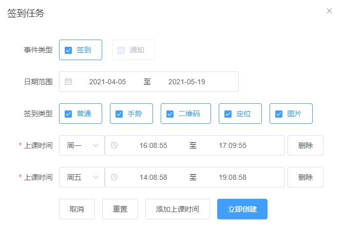
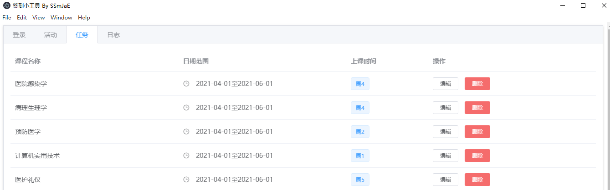

<h1 align="center">签到小工具</h1>

手动签到；自动签到；签到队列

## 声明
- 本项目基于GPL-3.0，完全开源，免费，仅供技术学习和交流，开发者团队并未授权任何组织、机构以及个人将其用于商业或者盈利性质的活动。也从未使用本项目进行任何盈利性活动。未来也不会将其用于开展营利性业务。
- 个人或者组织，机构如果使用本项目产生的各类纠纷，法律问题，均由其本人承担。
- 如果您开始使用本项目，即视为同意项目免责声明中的一切条款，条款更新不再另行通知。
- 如有触及相关平台规定或者权益，烦请联系我们删除。

## 使用
### 登录
- 可以账号密码登录，也可以直接提供cookie
- 如果账号密码登录，登录成功之后，会自动同步cookie，不需要再操作
- 如果直接提供cookie，需要先验证cookie有效性，验证成功后，点击替换cookie即可
- 长期使用之后，可能会在某次登录后提示cookie失效，重复上述两步即可
  - 尚未实现过期后自动使用账号密码重新获取cookie

### 活动
- 获取课程之后，可以添加至队列，也可以手动进行签到

### 签到任务设置
- 一门课程建议只配置一个任务，但是可以为该任务配置多个上课时间
- 选择合适的上课周期(最好和实际学期一致，或者和该门课的周期一致)和上课时间(比如可以比实际上课时间提前半小时)，小工具会根据任务的周期和时间，自动优化整合时间范围，保证监控的效率和精确
- 建议选择较大的监控频率(至少60s)，不然会被屏蔽，而获取不到活动信息

### 签到队列
- 添加、编辑、修改队列之后，是即时生效的，不需要重启

### 日志
- 可以筛选日志等级
- 可以控制是否自动下滑